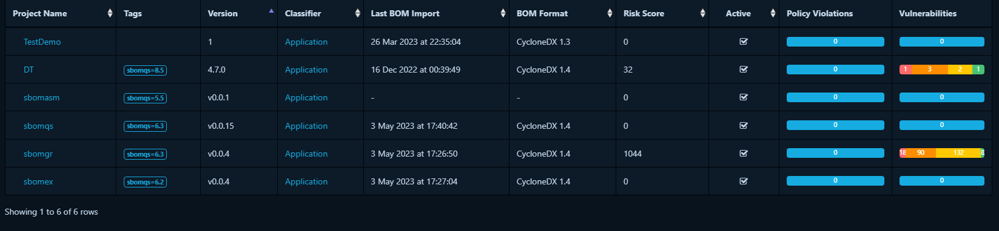

# `sbomqs`: Quality metrics for SBOMs

[](https://pkg.go.dev/github.com/interlynk-io/sbomqs)
[](https://goreportcard.com/report/github.com/interlynk-io/sbomqs)
[](https://securityscorecards.dev/viewer/?uri=github.com/interlynk-io/sbomqs)


`sbomqs` is your primary tool to assess an SBOM's quality and compliance. The higher the score the more consumable & compliant your SBOMs are.

[](https://app.interlynk.io/customer/products?id=7f52093e-3d78-49cb-aeb1-6c977de9442e&signed_url_params=eyJfcmFpbHMiOnsibWVzc2FnZSI6IklqUmhPRGRoTjJNNExXSXpZekl0TkdVeE9TMDVNRGxoTFRKbFpHRmlPR1ZoWldReVl5ST0iLCJleHAiOm51bGwsInB1ciI6InNoYXJlX2x5bmsvc2hhcmVfbHluayJ9fQ==--daf6585ecf8013a0b2713a5cebb28c140d29eed904b15c84c0566b9ddd334e71)

## [SBOM Platform](https://www.interlynk.io/) - [Free Community Tier](https://www.interlynk.io/community-tier)

Our SBOM Automation Platform has a free community tier that provides a comprehensive solution to manage SBOMs (Software Bill of Materials) effortlessly with following features:


The **community tier is ideal for small teams**. Learn more about [free community tier](https://www.interlynk.io/community-tier) or directly [Sign up](https://app.interlynk.io/auth).

## Documentation

👉 **[Installation](https://github.com/interlynk-io/sbomqs?tab=readme-ov-file#installation)**

👉 **[Quickstart](https://github.com/interlynk-io/sbomqs?tab=readme-ov-file#quickstart)**

👉 **[Read on - what defines high quality SBOMs](https://github.com/interlynk-io/sbomqs/blob/main/docs/sbom-quality.md)**

👉 **[Contributions guide](https://github.com/interlynk-io/sbomqs?tab=readme-ov-file#contributions)**

👉 **[Other OSS SBOM Tools](https://github.com/interlynk-io/sbomqs?tab=readme-ov-file#other-open-source-software-tools-for-sboms-)**

👉 **[Have Question: join our community](https://github.com/interlynk-io/sbomqs?tab=readme-ov-file#contact)**

## Installation

### Quick Install (Linux/macOS)

```console
curl -sSfL https://raw.githubusercontent.com/interlynk-io/sbomqs/main/install.sh | sh
```

### Using Homebrew (macOS/Linux with Homebrew installed)

```console
brew tap interlynk-io/interlynk
brew install sbomqs
```

### Using Go install

```console
go install github.com/interlynk-io/sbomqs@latest
```

### Using Docker

```console
docker pull ghcr.io/interlynk-io/sbomqs:latest
```

### Developer Installation

```console
1. git clone git@github.com:interlynk-io/sbomqs.git
2. cd sbomqs
3. make build
4. mv ./build/sbomqs /usr/local/bin
5. sbomqs version
```

## Quickstart

### 1. Summarized Scoring for Single SBOM

Scoring is categorized in various categories such as `ntia`, `bsi-v1.1`, `bsi-v2.0`, `quality`, `semantic`, `structural`, etc.
Each category has collection of features.

```sh
# summarized score for all categories
sbomqs score <sbom_file>

# summarized score for NTIA-minimum-elements(ntia) category
sbomqs score -c ntia <sbom_file> category

# summarized score for bsi-v1.1 category
sbomqs score -c bsi-v1.1 <sbom_file>

# summarized score for bsi-v2.0 category
sbomqs score -c bsi-v2.0 <sbom_file>
```

### 2. Compliance Report for a Single SBOM

sbomqs compliance command gives a detailed evaluation of a SBOM against compliances such as NTIA, BSI, OCT, FSCT, etc.

```sh
# compliance report for ntia
sbomqs compliance --ntia samples/photon.spdx.json

# compliance report for bsi-v1.1
sbomqs compliance --bsi samples/photon.spdx.json

# compliance report for bsi-v2.0
sbomqs compliance --bsi-v2 samples/photon.spdx.json

# compliance report for OpenChain Telco(oct)
sbomqs compliance --oct samples/photon.spdx.json

# compliance report for Framing Software Component Transparency(fsct)
sbomqs compliance --fsct samples/photon.spdx.json
```

### 3. List Components by Feature

The `list` command is useful to see the list of all components in the SBOM that has the provided feature.

```sh
# list of all components containing feature comp_with_name
sbomqs list --feature comp_with_name samples/photon.spdx.json

# list the doc element with feature sbom_with_primary_component
sbomqs list --feature sbom_with_primary_component  samples/photon.spdx.json

# list of all components containing feature comp_with_supplier
sbomqs list --feature comp_with_supplier samples/photon.spdx.json

# list of all components missing the feature comp_with_supplier
sbomqs list --feature comp_with_supplier samples/photon.spdx.json --missing
```

**NOTE**:

To see all the features that we support, jump [here](https://github.com/interlynk-io/sbomqs/blob/main/docs/list.md#supported-features)

#### Components with corresponding feature values

To see what values does that components have corresponding to that feature, add `--show` flag.

```sh
# list of all components with their corresponding values for a feature comp_valid_licenses
sbomqs list --feature comp_valid_licenses samples/photon.spdx.json  --show

# list of all components with their uniq IDs(purls, cpe, etc) for a feature comp_with_uniq_ids
sbomqs list --feature comp_with_uniq_ids  samples/photon.spdx.json  --show
```

### 4. Share Score of a SBOM using a shareable link at [sbombenchmark.dev](https://sbombenchmark.dev/)

sbomqs `share` is useful to share the score of your SBOM using a sharable link.

```sh
sbomqs share <sbom-file>
```

**Example**:

```sh
sbomqs share cdxgen-9.5.1_alpine-latest.cdx.json

5.9 cdxgen-9.5.1_alpine-latest.cdx.json
ShareLink: https://sbombenchmark.dev/user/score?id=a97af1bf-4c9d-4a55-8524-3d4bcee0b9a4
```

Now you can share this link <https://sbombenchmark.dev/user/score?id=a97af1bf-4c9d-4a55-8524-3d4bcee0b9a4> with anyone.

### 5. Check the Score of SBOM present in Dependency Track

If your SBOM is present in DependencyTrack platform, sbomqs supports `dtrackScore` to directly check score of it.

```sh
sbomqs dtrackScore  -u <dt-host-url> -k <dt-api-key> <project-uuid>

# Example:
sbomqs dtrackScore  -u "http://localhost:8080/" -k "IIcfPA9qc1F4IkQFa2FqQJoTwcfQI" bbd4434d-8062-4e59-a323-3b416701c948
```

o/p:

  

### 6. Check Score in an AirGapped Environment

```sh
./build/sbomqs score ~/wrk/sbom*/samples/*.json  -b
```

### 7. Run sbomqs using docker container

```sh
docker run -v <path_of_sbom_file>:/app/inputfile ghcr.io/interlynk-io/sbomqs score /app/inputfile


docker run -v $(pwd)/samples/sbomqs-cdx-cgomod.json:/app/inputfile ghcr.io/interlynk-io/sbomqs score /app/inputfile
```

## Contributions

We look forward to your contributions, below are a few guidelines on how to submit them

- Fork the repo
- Create your feature/bug branch (`git checkout -b feature/bug`)
- Commit your changes (`git commit -aSm "awesome new feature"`) - commits must be signed
- Push your changes (`git push origin feature/new-feature`)
- Create a new pull-request

## Other Open Source Software tools for SBOMs 🐧

- [SBOM Assembler](https://github.com/interlynk-io/sbomasm) - A tool for conditional edits and merging of SBOMs
- [SBOM Seamless Transfer](https://github.com/interlynk-io/sbommv) - A primary tool to transfer SBOM's between different systems.
- [SBOM Search Tool](https://github.com/interlynk-io/sbomgr) - A tool for context aware search in SBOM repositories.
- [SBOM Explorer](https://github.com/interlynk-io/sbomex) - A tool for discovering and downloading SBOM from a public SBOM repository
- [SBOM Benchmark](https://www.sbombenchmark.dev) is a repository of SBOM and quality score for most popular containers and repositories

## Contact

We appreciate all feedback. The best ways to get in touch with us:

- 💬 [Slack](https://join.slack.com/t/sbomqa/shared_invite/zt-2jzq1ttgy-4IGzOYBEtHwJdMyYj~BACA)
- 📞 [Live Chat](https://www.interlynk.io/#hs-chat-open)
- 📬 [Email Us](mailto:hello@interlynk.io)
- 🐛 [Report a bug or enhancement](https://github.com/interlynk-io/sbomex/issues)
- 🐦 [Follow us on X](https://twitter.com/InterlynkIo)

## Stargazers

If you like this project, please support us by starring it.

[](https://starchart.cc/interlynk-io/sbomqs)
