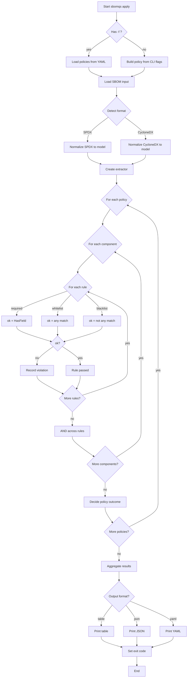

# SBOM Policy Specification

A policy file is a YAML document containing one or more policies.
Each policy defines:

- name --> unique name of the policy
- type --> whitelist, blacklist or required
- rules --> list of field checks
- action --> fail, warn, or pass

## Policy Types

It represent inclusion of specific fields and values.
It is of 3 types:

### 1. Whitelist

Ensures that SBOM field values must belong to the allowed set.

- Different fields → AND (all must pass).
- Multiple values within one field → OR (any match passes).

Examples:

```yaml
policy:
  - name: approved_licenses
    type: whitelist
    rules:
      - field: license
        values: [MIT, Apache-2.0, BSD-3-Clause]
    action: fail

```

- ✔ A component passes if its license is one of the listed values.

### 2. Blacklist

Ensures that SBOM field values must not belong to the banned set.

- Different fields → AND (all must avoid banned values).
- Multiple values/patterns within one field → OR (any match → violation).

Example:

```yaml
policy:
  - name: banned_components
    type: blacklist
    rules:
      - field: component_name
        patterns:
          - "log4j-1.*"
          - "commons-collections-3.2.1"
    action: fail

```

- ✔ A component fails if its component_name matches any of the patterns.

### 3. Required

Ensures that listed fields must be present in the SBOM.

- Different fields → AND (all must exist).

```yaml
policy:
  - name: required_metadata
    type: required
    rules:
      - field: supplier
      - field: version
      - field: license
      - field: checksum
    action: fail

```

- ✔ A component fails if any of these fields are missing.

## Actions

Based on the inclusion result, 3 types of actions:

- fail → Mark validation failure (stop or accumulate errors).
- pass → Explicitly mark policy as always passing.
- warn → Log violation, but continue processing.

## How Policy works ?

1. For each policy:
   1. Apply all rules.
   2. Different fields → AND logic.
   3. Multiple values/patterns within one field → OR logic.
2. Determine policy outcome (pass/warn/fail).
3. Aggregate results into a final compliance report.

Example:

```yaml
policy:
  - name: approved_licenses
    type: whitelist
    rules:
      - field: license
        values: [MIT, Apache-2.0, BSD-3-Clause]
    action: fail

  - name: banned_components
    type: blacklist
    rules:
      - field: component_name
        patterns: ["log4j-1.*", "commons-collections-3.2.1"]
    action: fail

  - name: required_metadata
    type: required
    rules:
      - field: supplier
      - field: version
      - field: license
    action: fail
```

o/p:

```text
Policy Results:
- approved_licenses (fail): 5 components with unapproved licenses
- banned_components (fail): 1 component found in blacklist
- required_metadata (warn): 3 components missing fields

Overall Policy Result: FAIL
```

## Applying Policies

Policies can be applied in two ways:

- From a policy file (YAML format)
- Directly from the CLI (inline rules)

### Apply from Policy File

When you already have a policy.yaml file:

```bash
sbomqs apply -f policy.yaml
```

This will load all policies defined in the file and evaluate them against the SBOM.

### Apply from CLI (inline rules)

You can also define policies directly from the CLI without a policy file.

#### Single Rule

Example: 1

```bash
sbomqs apply \
  --name approved_licenses \
  --type whitelist \
  --rule "field=license,values=MIT,Apache-2.0,BSD-3-Clause" \
  --action fail
```

Where,

`--name` → policy name

`--type` → policy type (whitelist, blacklist, required)

`--rule` → field validation rule (field=...,values=... or field=...,patterns=...)

`--action` → action on failure (fail, warn, pass)

Example: 2

```bash
sbomqs apply \
  --name supplier_noassertion_rule \
  --type blacklist \
  --rule "field=supplier,values=NOASSERTION" \
  --action fail
```

This defines a blacklist policy where:

- Supplier must have some values
- It must be NOASSERTION

## sbomqs policy flowchart


