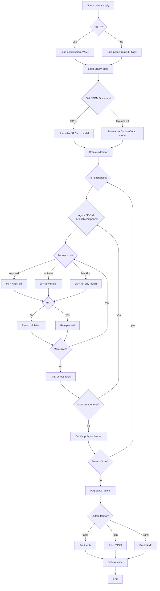

# SBOM Policy

An SBOM (Software Bill of Materials) often contains thousands of components with licenses, suppliers, checksums, and other metadata. Not all SBOMs are created equal — some may miss critical information or include risky components.

Policies help us automatically validate SBOMs against organizational requirements. They act like guardrails:

- Enforce approved licenses
- Reject banned components
- Ensure required metadata exists

In short, a policy defines what “good” looks like in an SBOM and how to react if something does not meet that expectation.

## What is Policy?

A policy file is a YAML defintion that contains.

- `name` --> A unique identifier for the policy
- `type` --> `The kind of check (whitelist, blacklist, required)
- `rules` --> A list of conditions applied to SBOM fields
- `action` --> What happens if violations are found (fail, warn, or pass)

Example:

```yaml
policy:
  - name: approved_licenses
    type: whitelist
    rules:
      - field: license
        values: [MIT, Apache-2.0, BSD-3-Clause]
    action: fail
```

This policy ensures every component license is one of the approved or defined values. If not(or violates), the policy fails as per the defined action.

## What is Rule?

A rule describes a specific check on a single SBOM field.
Each rule contains:

- `field` → The SBOM attribute to check (e.g., license, supplier, version)
- `values` → Allowed values (for whitelist/blacklist)
- `patterns` → Regex patterns to match field values
- `operator` (future support) → To extend comparisons (in, not_in, matches, not_matches)

### Rule evaluation logic

- **Multiple rules in a policy** → combined with **AND** (all must pass)
- **Multiple values/patterns in a rule** → combined with **OR** (any value passes)

## Policy Types

The type defines how rules are interpreted:

### 1. Whitelist

Ensures field values are only from the allowed set.

- Rule passes if the field value is in the values list.
- Violation if the value is outside the whitelist.

Example:

```yaml
policy:
  - name: approved_licenses
    type: whitelist
    rules:
      - field: license
        values: [MIT, Apache-2.0, BSD-3-Clause]
    action: fail

```

- ✔ Components with MIT or Apache-2.0 → `pass`
- ✘ Components with GPL-3.0 → violation, therefore action will be `fail`

### 2. Blacklist

Ensures field values are not in the banned set.

- Rule passes if the field value is not in the list/pattern.
- Violation if it matches.

```yaml
policy:
  - name: banned_components
    type: blacklist
    rules:
      - field: name
        patterns: ["log4j-1.*", "commons-collections-3.2.1"]
    action: fail
```

- ✔ Component okio-1.6.0 → pass
- ✘ Component log4j-1.2.17 → violation

### 3. Required

Ensures the field is present (not missing).

```yaml
policy:
  - name: required_metadata
    type: required
    rules:
      - field: supplier
      - field: version
      - field: license
    action: fail
```

- ✔ Component with supplier, version, and license → pass
- ✘ Component missing supplier → violation

## Actions

The action defines what happens when a violation is found:

- `fail` → Mark the policy as failed (exit code non-zero, block CI/CD pipeline)
- `warn` → Report the violation but continue (exit code zero)
- `pass` → Force pass even if violations exist (useful for dry-runs)

## How Policy Types and Actions Work Together

1. **Rules satisfied** → outcome is always `pass`.
2. **Rules violated** → outcome is whatever the policy’s `action` says:

- `fail` → mark as failed
- `warn` → mark as warning
- `pass` → override violations and still pass

This separation lets you define what to check (type + rules) and how serious it is (action).

## How Policies Work in Practice

1. Load policies (from file or CLI).
2. For each policy:
   1. For each rule: check field values in the SBOM.
   2. Collect violations.
3. Decide policy outcome (pass/warn/fail).
4. Aggregate all results into a final compliance report.

```yaml
policy:
  - name: approved_licenses
    type: whitelist
    rules:
      - field: license
        values: [MIT, Apache-2.0]
    action: fail

  - name: banned_components
    type: blacklist
    rules:
      - field: name
        patterns: ["log4j*"]
    action: fail

  - name: required_metadata
    type: required
    rules:
      - field: supplier
      - field: license
    action: warn
```

Output:

```bash
$ sbomqs policy -f samples/policy/custom/custom-policies.yaml samples/policy/in-complete.spdx.sbom.json 
+-------------------+-----------+--------+--------+---------+------------+----------------------+
|      POLICY       |   TYPE    | ACTION | RESULT | CHECKED | VIOLATIONS |     GENERATED AT     |
+-------------------+-----------+--------+--------+---------+------------+----------------------+
| approved_licenses | whitelist | warn   | warn   |       6 |          6 | 2025-09-16T08:24:57Z |
| banned_components | blacklist | fail   | fail   |       6 |          1 | 2025-09-16T08:24:57Z |
| required_metadata | required  | fail   | pass   |       6 |          0 | 2025-09-16T08:24:57Z |
+-------------------+-----------+--------+--------+---------+------------+----------------------+

```

```bash
$ sbomqs policy -f samples/policy/custom/custom-policies.yaml samples/policy/complete-sbom.spdx.json   
+-------------------+-----------+--------+--------+---------+------------+----------------------+
|      POLICY       |   TYPE    | ACTION | RESULT | CHECKED | VIOLATIONS |     GENERATED AT     |
+-------------------+-----------+--------+--------+---------+------------+----------------------+
| approved_licenses | whitelist | warn   | pass   |       5 |          0 | 2025-09-16T08:25:05Z |
| banned_components | blacklist | fail   | pass   |       5 |          0 | 2025-09-16T08:25:05Z |
| required_metadata | required  | fail   | pass   |       5 |          0 | 2025-09-16T08:25:05Z |
+-------------------+-----------+--------+--------+---------+------------+----------------------+
```

## Applying Policies

Policies can be applied in two ways:

1. From a policy file (YAML format)
2. Directly from the CLI (inline rules)

### 1. From a Policy File

```bash
sbomqs policy -f samples/policy/custom/custom-policies.yaml samples/policy/complete-sbom.spdx.json 
```

### 2. From CLI (Inline Rules)

```bash
sbomqs apply \
  --name approved_licenses \
  --type whitelist \
  --rules "field=license,values=MIT,Apache-2.0" \
  --action fail \
  samples/policy/complete-sbom.spdx.json
```

Example: 2

```bash
sbomqs apply \
  --name supplier_noassertion_rule \
  --type blacklist \
  --rules "field=supplier,values=NOASSERTION" \
  --action fail \
  samples/policy/in-complete-sbom.spdx.json
```

## sbomqs policy flowchart


